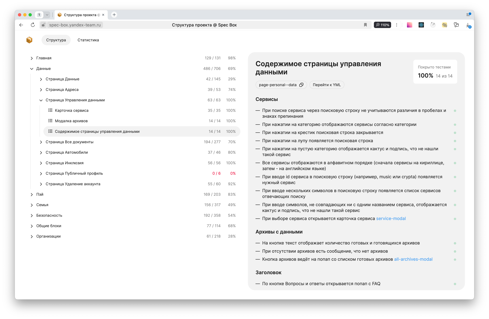

# SpecBox.WebUi

В этом репозитории находится веб-интерфейс для просмотра функциональный требований и информации о покрытии их автотестами.



## Как запустить локально

1. `nvm use`
1. `npm ci`
1. `npm start`

Перед запуском нужно поправить [хост в конфиге](./vite.config.ts#L25) — укажите хост, на котором запущен [бэкенд](https://github.com/spec-box/api).

## todo

- **сделать загрузку проектов в корне и прокидывать в навигацию проект из роута!**
- сделать выбор проекта в шапке
- подключить i18n

### мелочи

- прокидывать в навигацию код проекта из роута, а не из данных
- сделать сворачивание групп
- сделать логотип на главной и кнопку смены темы
- сделать отдельный callback для навигации и передавать в useRouteLink (чтобы не дублировать логику в компоненте FormattedText)
- сделать цвета для непрозрачных графиков в тёмной теме
- сделать стили для скролл-бара (на карточке плохо видно)

- настройки интерфейса:
  - как показывать ссылки на фичи (кодом или текстом); как вариант, показывать карточку ссылки
  - лимит, после которого подсвечивать покрытие красным

### sync how to

1. Установите пакет @spec-box/sync из внешнего npm
```sh
npm i @spec-box/sync@0.0.2-beta.19 --registry=https://registry.npmjs.org -D
```

1. Запустить экспорт данных (пример в /specs)
```sh
npx spec-box sync
```