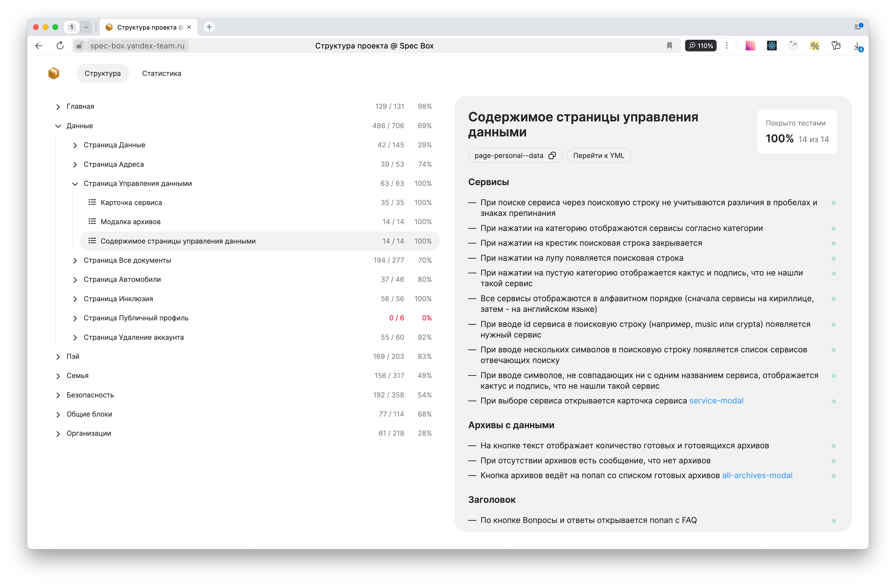

# SpecBox.WebUi

В этом репозитории находится веб-интерфейс для просмотра функциональный требований и информации о покрытии их автотестами.



## Как запустить локально

1. `nvm use`
1. `npm ci`
1. `npm start`

Перед запуском нужно поправить [хост в конфиге](./vite.config.ts#L25) — укажите хост, на котором запущен [бэкенд](https://github.com/spec-box/api).

## Разработка с агентами

Задачи в проекте делает команда агентов по спекам: планировщик исследует код и пишет OpenSpec-артефакты, реализатор пишет код по утверждённым задачам, ревьюер сверяет результат со спекой. Цикл ведёт скилл `/orchestrator` из [agentic-openspec](https://sourcecraft.dev/deepsweet/agentic-openspec/), спеки хранит [OpenSpec](https://github.com/Fission-AI/OpenSpec).

### Подготовка

1. `npm ci` — поставит OpenSpec CLI как dev-зависимость, дальше он вызывается через `npx openspec`.
1. Поставьте роли, агентов и скиллы:

   ```sh
   npx --yes --allow-git=all git+https://git.sourcecraft.dev/deepsweet/agentic-openspec.git#v0.3.7
   ```

   Команда скопирует роли и скиллы в `.agents/`, схему процесса в `openspec/schemas/agentic/` и слинкует их в `.claude/`, `.codex/` и `.cursor/`. Нужен один агент вместо трёх — добавьте `--target claude`. Версии — на [странице тегов](https://sourcecraft.dev/deepsweet/agentic-openspec/tags), изменения между ними — в `CHANGELOG.md` репозитория.

Скиллы и агенты лежат в репозитории, поэтому повторять установку нужно только при обновлении версии agentic-openspec.

### Как работать

- `/orchestrator <задача своими словами>` — запускает цикл. Оркестратор сам выберет этап, а перед реализацией спросит, утверждаете ли вы план.
- Тэг `#high` в тексте задачи — планировать будет модель посильнее.
- `/archiver` — после слияния изменения в `main` переносит дельта-спеки изменения в постоянные.
- Артефакты активного изменения — в `openspec/changes/<имя-изменения>/`, список изменений — `npx openspec list`.
- Проектные правила для агентов — в [openspec/config.yaml](./openspec/config.yaml): туда пишутся контекст проекта и требования к артефактам, а не в промпты.

## todo

- **сделать загрузку проектов в корне и прокидывать в навигацию проект из роута!**
- сделать выбор проекта в шапке
- подключить i18n

### мелочи

- прокидывать в навигацию код проекта из роута, а не из данных
- сделать сворачивание групп
- сделать отдельный callback для навигации и передавать в useRouteLink (чтобы не дублировать логику в компоненте FormattedText)

- настройки интерфейса:
  - как показывать ссылки на фичи (кодом или текстом); как вариант, показывать карточку ссылки
  - лимит, после которого подсвечивать покрытие красным
